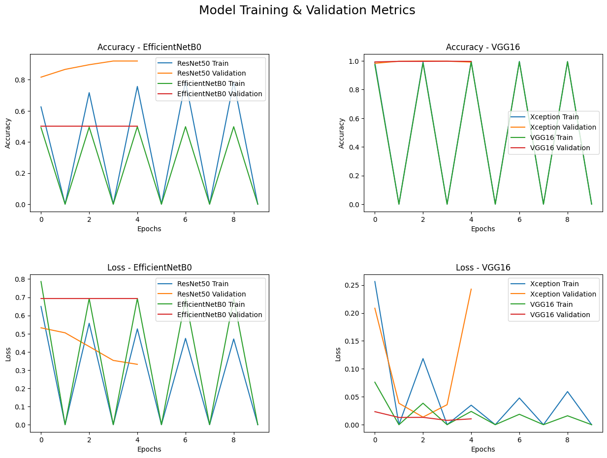
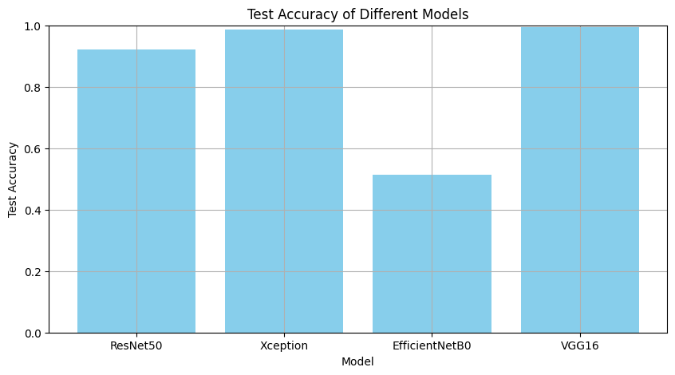

# **Face Mask Detection with Model Comparison**

### **Overview**
This project focuses on face mask detection using deep learning. We trained and evaluated four predefined models (ResNet50, Xception, EfficientNetB0, and VGG16) on a custom dataset to determine their efficiency in detecting whether a person is wearing a mask. The project also includes a comparison of the models based on metrics like accuracy, precision, recall, and inference time.

---

### **Features**
- Detects whether a person is wearing a mask.
- Compares the performance of four pre-trained models.
- Includes data augmentation using `ImageDataGenerator`.
- Saves and evaluates trained models to identify the most efficient one.
- Provides visualization of the results for better understanding.

---

### **Tech Stack**
- **Languages:** Python
- **Frameworks/Libraries:**
  - TensorFlow
  - Keras
  - PyTorch
  - OpenCV
  - NumPy
  - Matplotlib

---
### **Dataset**

The dataset for this project can be accessed from the following link:

[Kaggle - Mask and Social Distancing Detection](https://www.kaggle.com/code/nageshsingh/mask-and-social-distancing-detection-using-vgg19/input)


---
### **Results**
**Model Training & Validation Metrics:**


**Test accuracy:**


---

### **Folder Structure**
```plaintext
FaceMaskDetection/
│
├── README.md                 # Documentation (this file)
├── facemask_detection.ipynb  # Main notebook with training and evaluation
├── deploy.prototxt           # Model configuration for deployment
├── res10_300x300_ssd.caffemodel  # Pre-trained model for face detection
│
├── saved_models/             # Folder for saved model weights
│   └── resnet50.h5
│   └── xception.h5
│   └── efficientnetb0.h5
│   └── vgg16.h5
│
├── Face Mask Dataset/                  # Dataset folder
│   └── Test/
│   └── Train/
│   └── Validation
│
├── requirements.txt          # Python dependencies
